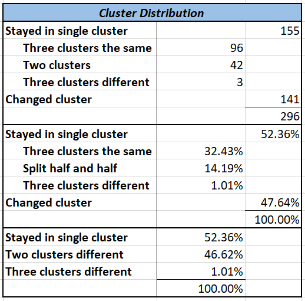
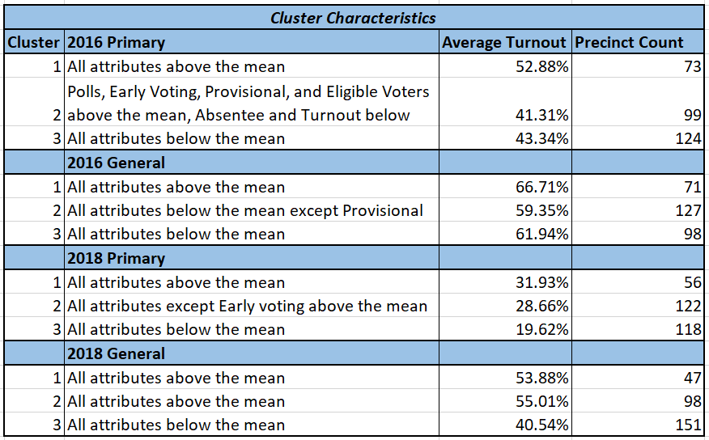
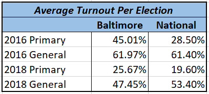

# Comparing Baltimore City Voter Turnout by Precinct in 2016 and 2018 Elections

## Business Question
What was voter turnout generally like in Baltimore City in 2016 and 2018? How could it be improved in 2020 and beyond?
1. Which precincts have better turnout? 
2. Do those rankings fluctuate between the primary and general elections and between years? 
3. Was there a visible change in turnout between 2016 and 2018, in light of the civil and social context of the 2018 election?

## Data Question
1. What are the general characteristics of the clusters for the four datasets (2016 Primary Election, 2016 General Election, 2018 Primary Election, and 2018 General Election)?
2. Which attributes signify the direction of voter turnout, based on the cluster nodes?
3. Is there any relationship between each political party's voter turnout per precinct and the cluster characteristics?

## Data Analysis Methodology
Baltimore City election data was found using the [Maryland State Board of Elections website](https://elections.maryland.gov/elections/2016/index.html "State Board of Elections").
I pulled the Baltimore City precincts data using the filter function. The numbers of votes cast and eligible voters for each precinct were grouped by political party, so I summed each attribute for each precinct to find total votes cast and voter turnout, regardless of party. I then did a three-anchor cluster analysis of each dataset, based off of the five attributes of (1) votes cast at polls, (2) votes cast in early voting, (3) by absentee ballot, and (4) by provisional ballot, as well as (5) number of eligible voters. I added a sixth attribute (voter turnout) by summing the first four attributes and dividing by the fifth.

After performing cluster analysis, I noticed that each cluster had an anchor with all attributes above the mean, an anchor with some attributes above and some below the mean, and an anchor with all attributes below the mean. I tweaked the numbers so that the anchors #1 corresponded with above average attributes, #2 with average, and #3 with below average for each dataset, without changing the cluster distribution or minimized sum of the squared distances. This made the cluster characteristics nearly identical across the board, so I could analyze the significance of a precinct changing clusters from election to election. The characteristics of each node and cluster distribution are outlined in the tables below.

## Findings

As the tables show, a slight majority of precincts stayed in the same cluster, demonstrating either consistently above average, average, or below average voter turnout. Most of the remaining precincts fluctuated between two clusters with only three precincts fluctuating between all three clusters. Interestingly, the precincts of the two-cluster group never jumped between clusters 1 and 3, only ever fluctuating between 1 and 2 or 2 and 3, as seen in the "Visualizations and Final Clusters" dataset in the Manipulated Datasets folder. In other words, only three precincts had both above average and below average voter turnout across the four elections surveyed; all other precincts either stayed in their lane (i.e. cluster) or fluctuated between above average and average, or below average and average.

Additionally, the above data for Baltimore City average voter turnout was also calculated while setting up the cluster analysis. While it was no surprise that voter turnout is greater in general elections compared to primaries, I was very surprised to find how much voter turnout dropped from 2016 to 2018. In light of the civic and social context of the 2018 election, I had expected to see the opposite trend. In fact, Baltimore's voter turnout in the 2018 general election was markedly lower than the national average of 53.4%. Conversely in 2016, Baltimore was slightly above the national average of 61.4%. National turnout averages were retrieved from the United States Census Bureau and Pew Research Center websites: [2016 Primary](https://www.pewresearch.org/fact-tank/2016/06/10/turnout-was-high-in-the-2016-primary-season-but-just-short-of-2008-record/ft_16-06-08_primaryturnout/), [2016 General](https://www.census.gov/newsroom/blogs/random-samplings/2017/05/voting_in_america.html), [2018 Primary](https://www.pewresearch.org/fact-tank/2018/10/03/turnout-in-this-years-u-s-house-primaries-rose-sharply-especially-on-the-democratic-side/), and [2018 General](https://www.census.gov/library/stories/2019/04/behind-2018-united-states-midterm-election-turnout.html).

## Addition about Trying to Match Neighborhoods
After class, I couldn't find any datasets or charts showing exactly which precincts correspond with which neighborhoods in Baltimore, but I did use data from the [Baltimore City Board of Elections](https://boe.baltimorecity.gov/boe-polling-locations), [this interactive map](http://mdpgis.mdp.state.md.us/Legis_District/index.html) and [this website](http://www.brookelierman.com/district-46/) from Brooke Lierman, the District 46 Delegate, to construct the tables in the "Clusters by Legislative District and Polling Place" dataset in the Manipulated Datasets folder. The (very rough) table with legislative districts can be used to study different parts of the city and comment broadly on voter turnout trends in each. The table with polling places could potentially be used to actually determine which neighborhood each precinct is in, assuming that (1) each polling place is actually located in its respective precinct, (2) there isn't too much overlap between neighborhoods and precincts (considering there are 296 precincts and not nearly that many neighborhoods in the city), and (3) there is some way to use Excel or another data tool to match street addresses to Baltimore neighborhoods.

## Significance and Further Analysis
This data could be useful for targetting particular precincts in a bid to increase voter turnout, as it shows both precinct voter turnout and their consistency over different elections. However, it would benefit from further analysis of the factors impacting voter turnout, as well as a survey of any changes in eligible voter numbers between these elections. The fact that both national and Baltimore turnout dipped in 2016 is very interesting and also worth further exploration.
